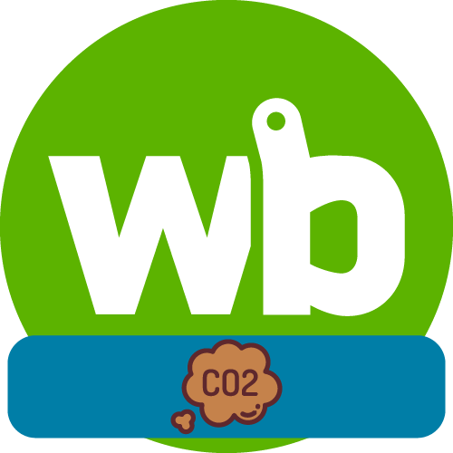
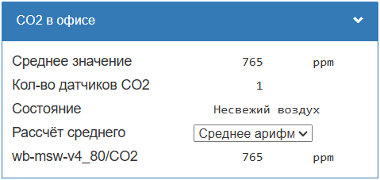

[](https://github.com/SmithLEDs/wb-buttonLight/releases/latest)
[](https://t.me/SmithLEDs)

<h1 align="left">
  <br>
  
  <br>
  <b>Модуль для датчиков углекислого газа CO2</b>
  <br>
</h1>

## Описание

Данный модуль создает новое виртуальное устройство с новыми контролами для слежения за датчиками CO2. 

* Следит за показаниями датчиков и формирует общее состояние самочувствия:

    | Значение | Значение контрола `Состояние` | Ощущения |
    | --- | :---: | --- |
    | < 600   | 1 | Приемлимо | 
    |  600-1000  |  2 | Жалобы на несвежий воздух |
    |  1000-2500 | 3 | Общая вялость |
    |  2500-5000 | 4 | Возможны нежелательные эффекты на здоровье |

* Можно указать один или множество датчиков.
* Подсчет среднего значения одним из трех способов на выбор: минимальное, максимальное, среднее арифметическое.
* Во все новые контролы с физических устройств передаются `meta #error` и при сбоях подкрашиваются красным цветом.
* Проверка всех топиков на существование при старте модуля. Создается цикличный таймер, который один раз в 5 секунд проверяет все устройства методом `getDevice`. Если после 60 попыток устройство так и не появилось, то загружаются все доступные устройства из переданных в модуль. Обычно устройства долго загружаются после физической перезагрузки контроллера. Поэтому нужно внимательнее передавать топики устройств, избегая ошибок в топиках.

## Передаваемые параметры в функцию и их описание:
- `title` - Описание виртуального устройства (Можно на русском)
- `name` - Имя виртуального устройства (Будет отображаться в новом виртуальном кстройстве как `name/...`)
- `targetCO2` - Одиночный топик или массив топиков, по изменению которых будет происходить обработка значений и вывод результата

## Примеры

На этом этапе у вас уже должен быть загружен модуль в контроллер. Смотри инструкцию на [главной странице](https://github.com/SmithLEDs/wirenboard#установка-модулей-в-контроллер).

### 

```js
var sensCO2  = require('moduleSensorCO2');    // Подключаем модуль для работы с датчиками CO2

// Для удобства создадим объект, где опишем нужные параметры
var CO2 = {
    title: 'CO2 в офисе',
    name: 'co2_office',
    target: ['wb-msw-v4_80/CO2']
};

// Передаём в функцию параметры
sensCO2.createCO2( CO2.title , CO2.name , CO2.target );

// Для компактности можно сразу передать в функцию параметры и обойтись одной строчкой:
sensCO2.createCO2( 'CO2 в офисе' , 'co2_office' , ['wb-msw-v4_80/CO2'] );
```
<h1 align="center">
  
  <br>
</h1>
 
 Теперь на изменении контрола `Состояние` можно организовать дальнейшую логику работы. Включить или выключить вентиляцию. Отправить уведомление.


## Версии `wb-rules`, на которых проверялась работоспособность:

- `v2.25.0-2-g105d68c`